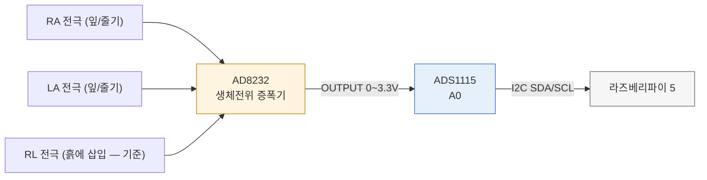

# 실시간 식물 상태 분류 시스템

AD8232(생체전위 증폭기) + ADS1115(16비트 ADC)로 식물 잎/줄기의 Ag 전극 미세 전위를 측정하고,
스펙트로그램 이미지 기반 머신러닝(SVM/Random Forest)으로 **정상 / 수분부족 / 자극** 3가지
상태를 실시간으로 분류하여 VNC 또는 브라우저(웹 대시보드)로 원격 모니터링하는 시스템입니다.
- **정상 · 수분부족** = 지속 상태(모니터링 대상), **자극** = 순간 이벤트(접촉/충격)
- 기본은 **3종 분류**이며, `정상-수분부족`·`정상-자극` 같은 **2종 비교**도 지원합니다.

## 빠른 시작 (전원 켜기부터 대시보드까지)

> 오랜만에 다시 켤 때 이 순서대로만 하면 됩니다. (라즈베리파이 5 + 노트북 1:1 랜선 연결 기준)

**0. 물리 준비 (제일 중요)**
- **SD카드를 딸깍 소리 나게 끝까지** 꽂으세요. (안 꽂히면 부팅이 안 되고, 파이가 자꾸 꺼지거나 랜포트 불도 안 들어옵니다.)
- 파이5 **정품 전원(27W USB-C)** 연결 → 빨간 불 들어오면 부팅 시작, 30초~1분 대기.
- 노트북과 **랜선** 연결.

**1. 파이에 접속** (노트북에서, Windows PowerShell)
```bash
ssh <사용자명>@<호스트명>.local     # 예: ssh pi@raspberrypi.local
# 안 되면 IP로: ssh <사용자명>@<파이 IP>
```
> 프롬프트가 `<사용자명>@<호스트명>:~ $` 로 바뀌면 접속 성공.
> 사용자명·호스트명은 라즈베리파이를 처음 설정할 때 정한 값입니다(기본값은 보통 `pi` / `raspberrypi`).
> 파이 IP는 파이에서 `hostname -I` 로 확인합니다.

**2. (선택) 코드 업데이트 — 인터넷 있을 때만**
```bash
cd ~/project
git pull                       # GitHub 최신 코드 받기
```
> 그냥 실행만 할 거면 인터넷/이 단계는 건너뛰어도 됩니다. 노트북 Wi-Fi 인터넷을 파이에 나눠주는 방법은 아래 "설치 및 업데이트" 참고.

**3. 가상환경 켜기**
```bash
cd ~/project
source venv/bin/activate       # 앞에 (venv) 가 뜨면 OK
```

**4. 대시보드 실행 (웹이 가장 편함)**
```bash
python3 main.py --web --sim_csv data/raw/수분부족.csv   # 센서 있으면 --sim_csv 빼기
```

**5. 브라우저로 보기** — 노트북/폰 브라우저 주소창에:
```
http://<파이 IP>:5000        # 예: http://192.168.0.23:5000
```
→ VNC 없이 대시보드가 뜹니다. (파이 IP는 파이에서 `hostname -I`)

```
요약:  ① SD카드+전원  →  ② ssh <사용자명>@<호스트명>.local
       ③ cd ~/project && source venv/bin/activate
       ④ python3 main.py --web --sim_csv data/raw/수분부족.csv
       ⑤ 브라우저 http://<파이 IP>:5000
```

> 실측 데이터를 새로 모은 게 아니라면 **다시 학습(preprocess/train)할 필요 없이 바로 실행**하면 됩니다. 모델은 이미 저장돼 있어요.

### 전원만 꽂으면 자동으로 켜지게 (SSH 없이)

위 ②~④단계를 매번 하기 싫으면 **한 번만** 등록해 두세요. 그 뒤로는 **전원 케이블만 꽂으면**
부팅과 함께 대시보드가 뜨고, 폰/노트북 브라우저로 바로 들어가면 됩니다.
모니터·키보드·SSH 전부 필요 없습니다.

```bash
cd ~/project
bash deploy/install.sh              # 자동시작 등록
bash deploy/install.sh --hotspot    # + 파이를 Wi-Fi 핫스팟으로 (공유기 없는 발표장용)
```

| 확인할 것 | 명령 |
|---|---|
| 지금 도는지 | `systemctl status plant-dashboard` |
| 로그 보기 | `journalctl -u plant-dashboard -f` |
| 잠깐 끄기 | `sudo systemctl stop plant-dashboard` |
| 자동시작 해제 | `sudo systemctl disable --now plant-dashboard` |

- 프로그램이 예외로 죽어도 **10초 뒤 자동 재시작**됩니다(`Restart=always`).
- 스크립트가 `deploy/plant-dashboard.service` 템플릿의 경로·사용자·파이썬을 **자동으로 찾아 채웁니다.**
  `venv`가 있으면 그 파이썬을 쓰고, 없으면 시스템 파이썬을 쓰며 경고를 띄웁니다.
- `i2c` 그룹에 없으면 자동으로 추가합니다(**재부팅 후 적용**).
- 실행 후 **상태 전환은 웹 화면의 모드 버튼**으로 하면 되므로(아래 `/api/mode` 참고) SSH가 필요 없습니다.

**접속 주소**
- 같은 Wi-Fi: `http://<파이 IP>:5000` (IP가 매번 바뀌면 `http://<호스트명>.local:5000` 도 됩니다)
- `--hotspot`으로 등록했으면: 폰을 `GML-PLANT`(비번 `gml12345`)에 연결 → `http://10.42.0.1:5000`

> 센서를 아직 안 붙였으면 하드웨어가 없으므로 자동으로 **시뮬레이션 모드**로 뜹니다.
> 센서를 붙이면 같은 서비스가 그대로 실제 신호를 읽습니다(코드 수정 불필요).

## 폴더 구조

```
project/
  data/raw/          # (1) 원시 시계열 CSV (정상.csv, 수분부족.csv, 자극.csv 중 수집된 것만)
  data/spectrogram/  # (2) 전처리된 224x224 스펙트로그램 이미지 (정상/, 수분부족/, 자극/)
  data/features.csv  # (2) 윈도우별 명시적 통계/주파수 특징 14개 (특징 모드 학습용)
  models/            # (3) 학습된 모델(.joblib) + confusion matrix 이미지
  src/
    sensor_control.py     # (1) 하드웨어 제어 및 데이터 수집
    preprocess.py          # (2) 대역통과필터 + 스펙트로그램 생성 + 명시적 특징 추출
    feature_extraction.py  # (2) 명시적 통계/주파수 특징 14개 정의 (preprocess/inference 공유)
    spectro_render.py      # (2) 컬러맵 룩업 테이블 기반 스펙트로그램 렌더링 (preprocess/inference 공유)
    train.py                # (3) SVM/RandomForest 학습 + 평가 (픽셀/특징 두 방식 비교 가능)
    inference.py            # (4) 실시간 추론 엔진
    gui.py                   # (4) VNC용 실시간 GUI / 헤드리스 대시보드
    web_dashboard.py         # (4) 브라우저용 실시간 웹 대시보드 (Flask, --web)
  web/                # (4) 초록말 UI (chorokmal.html + static/)
  deploy/
    plant-dashboard.service  # 전원만 꽂으면 자동 실행되게 하는 systemd 유닛 템플릿
    install.sh               # 위 유닛을 경로/사용자 자동 감지해 설치 (--hotspot 옵션)
    check_sensors.py         # 센서가 왜 안 잡히는지 한 번에 진단
  main.py             # 최상위 실행 진입점
  requirements.txt
  README.md
```

## 실행 모드 설정 (한눈에 보기)

### 학습 모드 (`src/train.py`)

| 옵션 | 값 | 의미 |
|---|---|---|
| **`--task`** | `3종` (기본) | 정상 vs 수분부족 vs 자극 → `models/best_model.joblib` |
| | `정상-수분부족` | 정상 vs 수분부족 → `models/best_model_정상-수분부족.joblib` |
| | `정상-자극` | 정상 vs 자극 → `models/best_model_정상-자극.joblib` |
| | `전체` | 위 3과제 전부 학습·비교 |
| **`--mode`** | `픽셀` (기본) | 스펙트로그램 이미지 픽셀 특징(50,176차원 + PCA) → `best_model.joblib` |
| | `특징` | 명시적 통계/주파수 특징 14개 → `best_model_특징.joblib` |
| | `둘다` | 픽셀 + 특징 모두 학습 후 비교 |

```bash
python3 train.py                               # 3종, 픽셀 (기본)
python3 train.py --task 정상-자극 --mode 둘다   # 정상 vs 자극, 픽셀+특징
python3 train.py --task 전체 --mode 둘다        # 전체 조합 학습·비교
```

### 실시간 추론 모드 (`main.py`)

| 옵션 | 값 | 의미 |
|---|---|---|
| **`--model`** | (기본 `best_model.joblib`) | 사용할 모델. 3종/2종/특징 모델로 교체 가능 |
| **`--sim_state`** | `정상`(기본)/`수분부족`/`자극`/`순환` | 하드웨어·CSV 없을 때 라이브로 생성할 상태(`순환`=8초마다 순환) |
| **`--sim_csv`** | CSV 경로 | 저장된 CSV를 재생해 시뮬레이션 입력으로 사용 |
| **`--no-gui`** | (플래그) | GUI 대신 헤드리스(터미널/Rich) 대시보드 |

```bash
python3 main.py                                       # 기본 3종 모델, GUI
python3 main.py --no-gui --model models/best_model_정상-자극.joblib --sim_csv data/raw/자극.csv
python3 main.py --no-gui --sim_state 순환             # 정상→수분부족→자극 순환 데모
```

> **입력 신호는 어디서 오나 (3가지)**
> 1. **실제 센서**(하드웨어) → 진짜 식물에서 나온 신호.
> 2. **`--sim_csv 파일`** → 예전에 저장해둔 CSV 신호를 **다시 재생**(녹음 재생 같은 것).
> 3. **`--sim_state`** → 센서도 CSV도 없을 때 **컴퓨터가 신호를 지어냄(생성)**. 어떤 상태를 지어낼지 고름:
>    - `정상`/`수분부족`/`자극` → 그 상태 신호**만 계속** 생성 (예: `정상`이면 화면에 계속 정상)
>    - `순환` → **8초마다** 정상 → 수분부족 → 자극 순으로 바꿔가며 생성 (센서·파일 없이 세 상태를 다 보여주는 **시연용**)
>
> 셋 중 우선순위: 하드웨어가 있으면 ①, 없고 `--sim_csv`가 있으면 ②, 둘 다 없으면 ③(`--sim_state`).

## 설치 및 업데이트

### 1. 저장소 받기 (처음 한 번, clone)

```bash
git clone https://github.com/P-SUNJiN/GML_SOURCECODE2.git project
cd project
```
> `project`는 받을 폴더 이름입니다(원하는 이름으로 바꿔도 됨). 이렇게 받아야 이후 `git pull`로 업데이트할 수 있습니다.
> 압축 파일을 수동 복사한 폴더는 git 저장소가 아니라 `git pull`이 안 됩니다.

### 2. 의존성 설치

**PC(개발/검증용):**
```bash
python3 -m venv venv
source venv/bin/activate
pip install -r requirements.txt
```

**라즈베리파이(권장):** 무거운 과학 라이브러리는 apt로 미리 빌드된 것을 받는 게 빠르고 안전합니다.
```bash
sudo apt install -y python3-numpy python3-pandas python3-scipy python3-matplotlib \
                    python3-sklearn python3-rich i2c-tools python3-smbus fonts-noto-cjk
python3 -m venv --system-site-packages venv   # apt로 깐 라이브러리를 venv에서 재사용
source venv/bin/activate
pip install adafruit-circuitpython-ads1x15 adafruit-blinka   # 하드웨어용(선택)
```

### 3. 업데이트 (코드가 바뀌었을 때, git pull)

```bash
cd project              # 프로젝트 폴더로 이동
git pull                # GitHub의 최신 코드 받기
rm -rf ~/.cache/matplotlib   # (그래프/폰트가 바뀌었을 때) matplotlib 폰트 캐시 새로고침
```
> - **동작 원리**: 코드는 GitHub(원격 저장소)에 있고, `git pull`로 각 기기(파이/PC)가 그 최신본을 당겨옵니다. GitHub에 반영해도 파이에 자동 적용되지는 않으니, 업데이트할 때마다 `git pull`을 실행하세요.
> - **충돌 시**: 로컬에서 파일을 직접 고쳐 `git pull`이 막히면 `git stash` → `git pull` → (필요 시) `git stash pop` 순서로 진행하세요.
> - **실측 데이터 보호**: `data/raw/`의 CSV는 직접 수집한 데이터라면 소중하니, 초기화/재클론 전에 다른 곳에 백업하세요.

> 라즈베리파이가 아닌 PC에서 실행하면 `adafruit-circuitpython-ads1x15` 임포트가 실패하며,
> `sensor_control.py`가 자동으로 **SIMULATION 모드**로 전환되어 실제 신호와 유사한 합성 신호를 생성합니다.
> 따라서 하드웨어 없이도 전체 파이프라인(수집→전처리→학습→실시간 추론)을 그대로 검증할 수 있습니다.

## 하드웨어 연결 구조 (한눈에 보기)

아래 부품들이 어떻게 서로 물려 있는지 전체 그림입니다. 각 배선의 자세한 핀 번호는
바로 아래 I2C 배선 섹션에 따로 있으니, 여기서는
"뭐가 뭐랑 연결되는지" 큰 그림만 먼저 보세요.



**핵심만 요약하면:**

| 신호 | 경로 |
|---|---|
| 식물 전위(자극/정상/수분부족 판단용) | RA/LA/RL 전극 → **AD8232**(증폭) → OUTPUT → **ADS1115 A0** → I2C → 파이 |
| 전원 | ADS1115·AD8232 VCC → 파이 **3V3(물리 1번)**, GND는 전부 공통 |

- AD8232는 ADS1115를 거쳐야만 파이가 읽을 수 있습니다(AD8232 자체엔 디지털 출력이 없음).
- RA/LA는 잎이나 줄기 표면, **RL은 반드시 흙(습한 부분)에** 꽂아야 기준 전위가 잡힙니다 — RL이 안 꽂혀 있으면 AD8232 출력이 전원 레일에 붙어버립니다(포화).

## 하드웨어 모드 준비 (라즈베리파이 I2C 활성화)

실제 AD8232+ADS1115로 신호를 수집하려면 라즈베리파이에서 **I2C 버스를 먼저 켜야** 합니다.
(I2C가 꺼져 있으면 `busio.I2C(...)` 초기화가 실패해 `sensor_control.py`가 SIMULATION 모드로 폴백합니다.)

### 1. I2C 활성화

**방법 A: raspi-config (메뉴)**
```bash
sudo raspi-config
# Interface Options → I2C → <Yes> 선택 → Enable → 재부팅
sudo reboot
```

**방법 B: 커맨드라인 (비대화형)**
```bash
sudo raspi-config nonint do_i2c 0   # 0 = enable
sudo reboot
```

> 최신 Raspberry Pi OS(Bookworm)에서는 부팅 설정 파일이 `/boot/firmware/config.txt`, 이전 버전은
> `/boot/config.txt` 입니다. 직접 편집하려면 해당 파일에 `dtparam=i2c_arm=on` 한 줄이 있는지 확인하세요.

### 2. I2C 도구 설치 및 배선 확인

```bash
sudo apt update
sudo apt install -y i2c-tools python3-smbus

i2cdetect -y 1     # I2C 버스 1번 스캔
```
ADS1115가 정상 연결되면 아래처럼 **주소 `0x48`** 이 표에 나타납니다(ADDR 핀 배선에 따라 0x49/0x4A/0x4B일 수 있음).
```
     0  1  2  3  4  5  6  7  8  9  a  b  c  d  e  f
40: -- -- -- -- -- -- -- -- 48 -- -- -- -- -- -- --
```

**배선(ADS1115 ↔ 라즈베리파이 GPIO 헤더)**

| ADS1115 핀 | 라즈베리파이 핀 | 비고 |
|---|---|---|
| VDD | 3V3 (물리 1번) | 3.3V 권장 |
| GND | GND (물리 6번) | AD8232와 공통 GND |
| SCL | GPIO3 / SCL1 (물리 5번) | I2C 클럭 |
| SDA | GPIO2 / SDA1 (물리 3번) | I2C 데이터 |
| A0 | AD8232 OUTPUT | 측정할 아날로그 신호 입력 |

> `i2cdetect`에 `0x48`이 안 보이면: ① 배선(SDA/SCL 바뀜, GND 공통 아님) 재확인, ② `sudo raspi-config`에서
> I2C가 실제 Enable인지, ③ 재부팅했는지 확인하세요. 주소가 0x48이 아니면 `src/sensor_control.py`의
> `ADS.ADS1115(i2c)` 부분에 `address=0x49`처럼 지정하면 됩니다.

### 3. 하드웨어 라이브러리 설치 및 동작 확인

```bash
pip install adafruit-circuitpython-ads1x15 adafruit-blinka
cd src
python3 sensor_control.py --state 정상 --duration 5 --rate 250 --settle 0
```
실행 로그 첫 줄이 `모드: HARDWARE (AD8232+ADS1115)` 로 나오면 하드웨어 모드로 정상 동작하는 것입니다.
(`SIMULATION (no I2C hardware detected)` 으로 나오면 위 1~2단계를 다시 점검하세요.)

### 4. 측정 전 확인 — 증폭기 기준점

수집을 시작하기 전에 **AD8232 출력이 전원 레일에 붙어 있지 않은지** 확인하세요.
레일에 붙은 상태(포화)에서는 입력이 변해도 출력이 움직이지 않아, 아무리 오래
수집해도 쓸 수 없는 데이터가 나옵니다.

**웹에서** — 관리자 패널 **`센서`** 탭의 **`진단하기`**

```
I2C 버스        : OK
ADC(ADS1115)    : ADS1115
기준점          : 1.072 V
판정            : 정상 범위
```

포화된 경우에는 이렇게 나오고, 확인할 순서가 함께 표시됩니다.

```
기준점          : 2.582 V
판정            : 상단 레일 포화 — 전극 연결을 확인하세요
```

**터미널에서** — 더 자세한 진단(파이 모델, I2C 스캔, 라이브러리, 10초 전극 측정)

```bash
cd ~/project/src
python3 check_sensors.py
```

포화가 나오면 아래 순서로 확인하세요.

1. **RA·LA·RL 세 전극이 모두 닿아 있는지.** 하나라도 떠 있으면 출력이 레일로 밀립니다.
2. **RL(기준) 전극의 접촉.** RL은 단순 접지가 아니라 능동 피드백 회로의 출력단이라,
   여기가 기준 전위를 못 잡으면 나머지가 멀쩡해도 포화됩니다.
3. **AD8232와 ADS1115의 GND가 공통인지.** 접지가 갈라져 있으면 기준 전위 자체가 어긋납니다.

> RL을 어디에 두는 것이 좋은지는 측정 환경마다 다릅니다. 조건을 바꿔가며 위 진단으로
> 기준점을 비교해, 레일에 붙지 않고 전원 범위 가운데에 오는 위치를 찾으세요.

### 5. 원격 접속 — 블루투스로 웹을 열 수 있나?

**결론: 블루투스로도 되긴 하지만 권장하지 않습니다.** 블루투스는 PAN(Personal Area Network) 프로파일로
IP를 태울 수 있어서 `http://<블루투스 IP>:5000` 접속이 이론상 가능하지만, 페어링이 자주 끊기고
속도가 느려 실시간 그래프에 부적합합니다. 아래 순서로 고르세요.

**① 같은 Wi-Fi (가장 간단, 추천)**
```bash
hostname -I          # 예: 192.168.0.23
python3 main.py --ui web --port 5000
```
같은 공유기에 붙은 노트북/폰에서 `http://192.168.0.23:5000` 접속.

**② 파이를 Wi-Fi 핫스팟으로 (공유기가 없는 발표장/교실에서 추천)**
```bash
sudo nmcli device wifi hotspot ifname wlan0 ssid GML-PLANT password "gml12345"
```
폰/노트북을 `GML-PLANT`에 연결한 뒤 `http://10.42.0.1:5000` 접속. (되돌리기: `sudo nmcli connection down Hotspot`)

**③ USB 테더링** — 파이와 노트북을 USB로 연결하면 가상 이더넷이 생겨 `http://<파이 USB IP>:5000`으로 접속됩니다.

**④ 블루투스 PAN (정말 필요할 때만)**
```bash
sudo apt install -y bluez bluez-tools
sudo bt-network -s nap wlan0        # 파이를 NAP(네트워크 공유) 서버로
```
폰에서 파이와 페어링 → "인터넷 액세스/테더링" 허용 → 파이의 `bnep0` IP로 접속.

### 6. 웹에서 모드 바꾸기 (`/api/mode`)

파이에 코드가 올라가 있으면 시뮬레이션 상태를 **웹 화면 버튼으로 바로 전환**할 수 있습니다.
대시보드 상단의 `정상 / 수분부족 / 자극 / 순환` 버튼이 아래 API를 호출합니다.

```bash
curl http://<파이IP>:5000/api/mode
# {"source_kind":"sim","source":"시뮬레이션 · 정상","sim_state":"정상",
#  "options":["정상","수분부족","자극","순환"],"editable":true}

curl -X POST http://<파이IP>:5000/api/mode \
     -H "Content-Type: application/json" -d '{"sim_state":"자극"}'
```

> 실제 센서(하드웨어)나 CSV 재생으로 실행 중일 때는 바꿀 대상이 없으므로 `409`를 돌려주고
> 화면의 버튼도 비활성화됩니다(`editable: false`). 목록에 없는 값은 `400`입니다.

### 7. 웹에서 데이터 수집 · 변환 · 학습 (`/api/collect`, `/api/preprocess`, `/api/train`)

헤더의 **`🔒 관리자`** 로 로그인하면 관리자 패널이 열립니다. **SSH 없이 브라우저에서**
데이터 수집부터 스펙트로그램 변환, 학습, 새 모델 적용까지 전부 됩니다.

```
[1 · 수집] [2 · 변환] [3 · 학습] [자료] [센서]    수집 3/3 · 변환 3/3 · 모델 SVM
   ── 실행 로그가 아래에 실시간으로 흐름 ──
```

### 관리자 잠금

**데이터를 바꾸는 동작은 관리자만** 할 수 있습니다. 헤더의 **`🔒 관리자`** 를 눌러 로그인하면
관리자 패널이 나타납니다. 로그인 전에는 패널 자체가 **보이지 않습니다**.

| 잠김 (로그인 필요) | 열림 (누구나) |
|---|---|
| 수집 · 변환 · 학습 · 중지 | 실시간 화면 보기 |
| 파일 삭제 · 휴지통 복원/비우기 | 모드 전환 (정상/수분부족/자극/순환) |
| **모델 전환**(`사용하기`) | 자료 목록 보기 · 내려받기 · 센서 진단 |

- **기본 비밀번호는 `3831`** 입니다. 처음 실행할 때 자동으로 걸리므로 따로 설정할 필요가 없습니다.
  `data/admin.json` 에 해시 + 솔트로 저장됩니다(PBKDF2-SHA256 20만 회, 평문 저장 아님).
- 바꾸려면 둘 중 하나:
  ```bash
  # ① 다른 기본값으로 다시 만들기
  rm data/admin.json && GML_ADMIN_PW=새비번 python3 main.py --web

  # ② 로그인한 상태에서 API 로 변경
  curl -c c.txt -X POST http://<파이IP>:5000/api/auth/login \
       -H "Content-Type: application/json" -d '{"password":"3831"}'
  curl -b c.txt -X POST http://<파이IP>:5000/api/auth/setup \
       -H "Content-Type: application/json" -d '{"password":"새비번"}'
  ```
- 한 번 로그인하면 **30일 유지**됩니다. 브라우저를 껐다 켜도, 새로고침해도 그대로예요.
- 비밀번호를 잊었으면 `rm data/admin.json` 후 다시 실행하면 기본값 `3831` 로 돌아갑니다.

> ⚠️ 같은 Wi-Fi 안에서 **HTTP로 평문 전송**됩니다. 인터넷에 열어두는 보안 장치가 아니라,
> 발표 중에 누가 실수로 누르거나 장난치는 것을 막는 잠금장치로 생각하세요.

### 관리자 패널 — 탭으로 정리

```
[1 · 수집] [2 · 변환] [3 · 학습] [자료] [센서]        수집 3/3 · 변환 3/3 · 모델 SVM
```

| 탭 | 하는 일 |
|---|---|
| **1 · 수집** | 상태를 고른 뒤 `▶ 측정 시작` 을 눌러야 시작 (실수로 덮어쓰지 않게) |
| **2 · 변환** | 상태별로 따로 스펙트로그램 변환 (`preprocess.py --only`) |
| **3 · 학습** | 아래 참고 — 데이터가 갖춰진 과제만 고를 수 있고, 지난 학습 기록도 보임 |
| **자료** | 파일 보기 · 내려받기 · 휴지통 · **모델 바로 전환** |
| **센서** | 증폭기 기준점 확인 (레일 포화 진단) |

- 오른쪽 위 **요약**(`수집 3/3 · 변환 3/3 · 모델 SVM`)이 어느 탭에 있든 전체 진행 상황을 보여줍니다.
- **실행 로그는 패널 맨 아래에 항상** 있어서, 탭을 옮겨도 진행 상황이 안 사라집니다.
- **마지막에 고른 값을 기억합니다** — 수집 길이, `중지할 때까지`, 학습 과제/방식, 열어둔 탭까지.
  새로고침해도 그대로라 실험을 반복할 때 다시 고를 필요가 없습니다.

#### 3 · 학습 탭 — 데이터 현황부터 결과 기록까지 한 화면에

```
상태별 변환 현황:  정상: ✓ 변환됨 299장   수분부족: 미수집   자극: ✓ 변환됨 31장

과제:  [3종(잠김)] [정상-수분부족(잠김)] [정상-자극] [전체(잠김)]
방식:  [픽셀] [특징] [둘다]
▶ 학습 시작    '정상-자극' 과제로 학습합니다

최근 학습 결과
  정상-자극   특징 · RandomForest · train 231 test 99 · 43초 걸림   99.0%   8/11 14:02
  정상-자극   픽셀 · SVM · train 231 test 99 · 4분12초 걸림          70.0%   8/11 13:55
```

- **과제 버튼은 필요한 상태가 다 변환돼 있어야 눌립니다.** 수분부족이 없으면 `3종`·`정상-수분부족`이
  자동으로 잠기고, 마우스를 올리면 "먼저 변환하세요: 수분부족" 처럼 이유가 뜹니다.
- **학습이 끝나면 방금 학습한 것 중 정확도가 가장 높은 모델이 자동으로 적용됩니다.**
  (과제=`전체`처럼 한 번에 여러 파일이 나올 때도 가장 좋은 것으로 골라줍니다)
- **최근 학습 결과**에 과제·방식·모델 종류·train/test 샘플 수·**걸린 시간**·정확도·시각이
  최신순으로 남습니다. 70% 미만이면 빨간색으로 표시됩니다.
- `GridSearchCV`가 도는 동안 fold 하나 끝날 때마다 로그에 진행 상황이 찍힙니다
  (픽셀 모드는 PCA+SVM/RF 조합이 많아 파이에서 몇 분씩 걸릴 수 있는데, 이 로그로
  "멈춘 게 아니라 도는 중"이라는 걸 확인할 수 있습니다).

#### 자료 탭 — 예전에 학습해 둔 모델로 바로 전환

`학습된 모델` 목록에서 `best_model_...joblib` 파일 옆의 **`사용하기`** 버튼을 누르면,
재학습 없이 그 모델을 바로 지금 쓰는 모델로 바꿉니다. (`svm_model_*`/`rf_model_*`은
비교용으로 남긴 raw 분류기라 번들 정보가 없어서 이 버튼이 안 뜹니다.)

상태 하나만 다시 모았으면 **그 상태만 다시 변환**하면 됩니다. 나머지 상태의 이미지와
`features.csv` 행은 그대로 유지됩니다.

```
[preprocess] 기존 특징 58행 유지 + '자극' 새로 29행
[preprocess] 클래스별 개수: {'수분부족': 29, '정상': 29, '자극': 29}
```

변환 버튼에는 **지금 몇 장이 만들어져 있는지**가 표시되고(`정상 (29장)`),
아직 수집하지 않은 상태는 눌리지 않습니다.

#### 전원 노이즈 — 한국은 60Hz입니다 (자동 감지)

실측 데이터에서 **60Hz가 전체 파워의 60.3%, 120Hz(2배수)가 32.7%** 를 차지했습니다.
합쳐서 93%. 전극과 식물이 안테나 역할을 해서 전등·콘센트의 교류를 그대로 주워 옵니다.

그래서 노치 필터 **기본값을 60Hz(한국 상용 전원)** 로 두고, 여기에 더해 신호에서 50Hz와
60Hz의 파워를 직접 재서 **센 쪽으로 자동 보정**합니다. (예전 기본값은 50Hz였는데, 그 값은
유럽·시뮬레이션 기준이라 한국에서는 아무 일도 하지 않았습니다.)

```
[전원 노이즈] 50Hz 0.0% / 60Hz 60.3% -> 노치를 60Hz 로 맞춤
[preprocess] 노치 주파수 60Hz 를 메타에 기록합니다(자동 감지).
```

- 감지한 값은 `preprocess_meta.json` → 모델 번들에 저장되어 **추론도 같은 필터**를 씁니다.
  (자동 보정만 하고 기록하지 않으면 학습과 추론의 필터가 달라집니다)
- 파일마다 다른 값이 나오면 경고합니다 — 서로 다른 전원 환경의 데이터가 섞였다는 뜻입니다.
- `--notch 0` 으로 끄거나 `--notch 50` 으로 고정할 수 있습니다(50Hz 지역에서 수집한 데이터).

> 대역통과 상한이 20Hz라 60Hz는 통과대역에서 한참 벗어나 있지만, 4차 Butterworth의
> 감쇠만으로 완전히 0이 되지는 않아 노치를 함께 겁니다.

#### 분석 대역과 창 길이를 왜 이렇게 잡았나

처음에는 심전도 기본값(2초 창, 0.5~45Hz)을 그대로 썼습니다. 심장 신호에는 맞지만
식물 신호에는 맞지 않습니다. 두 가지를 겹쳐서 다시 정했습니다.

**① 같은 센서를 쓴 선행연구** — **AD8232로 식물 신호를 분류한 연구가 이미 있습니다.**
MIT의 2025년 연구는 AD8232를 400Hz로 돌려 **3초 구간**(1초 겹침)을 스펙트로그램으로 바꿔
CNN에 넣었고, 같은 해 NJAS 논문은 AD8232 + 아두이노로 모은 신호를 **15초 구간**으로 잘라
Random Forest·CNN·LSTM 등을 비교했습니다. 창 길이는 이 **3~15초** 범위 안에서 정하면
됩니다.

**② AD8232가 실제로 통과시키는 대역** — 이 보드는 심전도용이라 아날로그 필터가
회로에 박혀 있습니다. **0.5Hz 고역통과 + 40Hz 저역통과**(2차씩). 소프트웨어에서
하한을 0.1Hz로 낮춰도 **회로가 이미 지운 신호는 돌아오지 않습니다.**

그래서 대역은 **0.5~20Hz**로 잡았습니다. 하한은 회로가 정한 값이고, 상한은 식물 신호가
거의 없는 20~40Hz 구간의 잡음을 빼기 위해 낮췄습니다. 창은 위 선행연구 범위(3~15초)의
가운데인 **10초**, 스텝은 2초(80% 겹침)로 정했습니다.

> 문헌에 따르면 식물 반응은 **수 초에서 수백 초**까지 이어집니다. 창을 더 늘리고
> 싶어지지만, AD8232의 0.5Hz 고역통과가 그 느린 부분을 이미 지웠기 때문에 창만
> 늘려도 얻는 것이 없습니다. 이 하드웨어로 볼 수 있는 것은 반응의 **빠른 시작
> 부분**입니다. (아래 [측정 한계](#ad8232로-잴-수-있는-신호의-크기와-속도--이게-구조적-한계입니다) 참고)

| | 예전 (심전도 기본값) | 지금 |
|---|---|---|
| 분석 창 | 2초 | 10초 |
| 스텝 | 1초 | 2초 |
| 대역통과 | 0.5~45Hz | 0.5~20Hz |
| 노치 | 50Hz | 60Hz (한국) |
| 스펙트로그램 세로축 | 0~125Hz (관심대역 16줄) | 0~20Hz (관심대역 41줄) |

#### AD8232로 잴 수 있는 신호의 크기와 속도 — 이게 구조적 한계입니다

AD8232의 총 이득은 **1100배**입니다(계측증폭기 100배 × 저역통과단 11배). 심전도
신호가 500µV~5mV라서 그 크기에 맞춰 설계된 값입니다. 아날로그 대역도 **0.5~40Hz**로
회로에 고정되어 있습니다.

식물 쪽 문헌과 나란히 놓으면 두 군데가 어긋납니다.

| | 문헌이 말하는 식물 표면 전위 | AD8232가 감당하는 범위 |
|---|---|---|
| 진폭 | 수 mV ~ 수십 mV (표면 전극 기준), 작은 과도신호는 1mV 미만 | 전극 입력 환산 **약 ±1.2mV** 안 |
| 지속 시간 | 수 초 ~ 수백 초 (표면 전극 기준) | **0.5Hz 위**만 통과 (≈2초보다 느린 성분은 지워짐) |

- **진폭**: 이득이 1100배라 전극 사이 전압이 ±1.2mV만 넘어도 출력이 전원 레일에
  부딪혀 **잘립니다.** 기준점이 한쪽으로 치우쳐 있으면 여유는 더 줄어듭니다(예: 기준점
  1.02V면 아래쪽 여유가 입력 환산 **±0.65mV**). 문헌이 보고하는 수 mV~수십 mV급
  반응이 들어오면 "작게 보이는" 게 아니라 **아예 잘려서 레일 포화로 나타납니다.**
  1mV 미만의 작은 과도신호만 잘리지 않고 들어옵니다.
- **속도**: 0.5Hz 고역통과가 회로에 박혀 있어서, 수십 초에 걸친 느린 반응은 그 **모양
  전체가 아니라 시작 부분의 빠른 변화만** 남습니다. 소프트웨어에서 하한을 낮춰도
  되살아나지 않습니다.

수집 중 레일 포화가 자주 보인다면 접촉 불량뿐 아니라 이 구조적 한계도 함께 의심해야
합니다. 그래서 코드는 진단 메시지에서 신호 크기를 **전극 입력 기준(mV)으로 환산해서**
보여줍니다 — 증폭기 출력 볼트를 그대로 문헌값과 비교하면 1100배만큼 틀린 이야기가
되기 때문입니다.

> 위 이득·대역 값은 AD8232 데이터시트의 심전도 구성 기준이고, **이 프로젝트에서 직접
> 측정해 확인한 값은 아닙니다.** 보드에 따라 다를 수 있습니다.

#### 전극 안정화 대기와 표류 감시

선행연구는 전극을 붙인 뒤 **안정화 시간을 두고** 취득을 시작합니다. 전극을 붙이거나
꽂는 행위 자체가 식물에 상처·자극 반응을 일으키고, 접촉 전위도 붙인 직후에 가장 크게
흔들리기 때문입니다. 또 젖은 전극은 시간이 지나며 마르고, 그때 느린 표류가 생깁니다.

- 수집을 시작하면 **20초 동안 기다렸다가**(이 구간은 저장하지 않음) 기록을 시작합니다.
  `--settle 0` 으로 끌 수 있습니다.
- 수집이 끝나면 구간 전체의 기울기를 재서 **분당 표류량**을 알려주고, 이 속도면 몇 분
  뒤에 레일에 닿는지 계산해 줍니다.

```
[sensor_control] 전극 안정화 대기 20초 (붙인 직후의 접촉 전위·상처 반응이 가라앉기를 기다립니다)
[sensor_control] 안정화 후 기준점 1.021V (대기 시작 무렵 0.983V -> +0.038V 이동)
[sensor_control] 기준점 표류: 출력 +12.4 mV/분 (전극 입력 환산 +0.0113 mV/분, ...)
```

#### 전극 — 동봉된 심전도 패드는 잎에 잘 안 통합니다

AD8232 키트에 들어 있는 **부착형 심전도 패드는 사람 피부용**입니다. 피부는 접촉 저항이
50kΩ 안팎이지만, 잎 표면은 **왁스층(큐티클)** 때문에 MΩ 단위로 훨씬 높습니다.

임피던스가 높으면 AD8232의 **fast-restore** 회로(입력 오프셋이 클 때 내부 고역통과
필터를 순간적으로 초기화하는 기능)가 계속 재작동해서, 출력이 **주기적으로 0V까지
떨어졌다 복귀**합니다. 실측에서 168ms 간격으로 20ms 동안 내려갔다 올라오는 파형이
전체의 1.4%를 차지했고, 스펙트럼에는 6Hz와 그 배수가 줄줄이 나타났습니다.

**재료가 없을 때 — 점퍼선으로 (키트에 있는 것만)**

알루미늄 포일이나 소금이 없어도 됩니다. **점퍼선이 가장 좋은 전극입니다.**

1. 수-수 점퍼선의 **금속 핀을 줄기에 살짝 찔러 넣습니다**(1~2mm). 식물 전기생리 논문에서
   쓰는 방식과 같습니다. 상처가 아주 작고 접촉 저항이 압도적으로 낮습니다.
2. 찌르기 싫으면, 점퍼선 끝의 **피복을 벗겨 구리선을 줄기에 감고** 테이프로 고정합니다.
3. 접점에 **수돗물 한 방울**만 묻혀도 됩니다(소금 없어도 미네랄이 있어 통합니다).
4. 심전도 패드의 **똑딱이 단추**에 점퍼선을 물리면 리드선을 그대로 쓸 수 있습니다.

> 왜 점퍼선이 패드보다 나은가: 패드는 잎 **표면**의 왁스층 위에 얹히지만, 점퍼선 핀은
> 왁스층을 **뚫고 물관 조직에 직접** 닿습니다. 접촉 저항이 수백 배 차이 납니다.

**전극 만들기 (알루미늄 포일이 있을 때)**

1. **알루미늄 포일**을 3×3cm 정도 잘라 **잎자루(잎과 줄기가 만나는 두꺼운 부분)** 를 감쌉니다.
2. 포일 위에 **집게 클립**을 물리고 AD8232의 RA / LA에 연결합니다.
3. RL은 **젖은 흙에 3cm 이상** 찔러 넣습니다.
4. 마르지 않게 **랩으로 감싸고**, 선은 테이프로 고정합니다(움직이면 오프셋이 생겨
   fast-restore가 또 터집니다).

| 방법 | 효과 |
|---|---|
| 접촉 면적 키우기(잎 한 점 → 잎자루를 감싸기) | 큼 |
| 알루미늄 포일 + 클립 | 큼 |
| 줄기에 핀 전극 찔러넣기 | 가장 확실하지만 식물에 상처 |

**얼마나 좋아졌는지 재는 법** — 수집이 끝나면 0V 강하 비율을 알려줍니다.
접촉이 좋아질수록 이 비율이 떨어지고, **0에 가까우면 성공**입니다.

```
[sensor_control] ⚠️  주기적인 0V 강하가 발견됐습니다 (6.0Hz = 168ms 간격, 전체의 1.4%).
    여러 샘플에 걸쳐 부드럽게 내려갔다 올라옵니다 = 실제 아날로그 파형입니다.
    AD8232 의 fast-restore 가 계속 재작동하는 것으로 보입니다.
```

> 검사는 **강하의 모양**으로 원인을 나눕니다. 여러 샘플에 걸쳐 부드럽게 내려갔다
> 올라오면 아날로그(전극 문제), 한 샘플만 툭 튀고 이웃이 멀쩡하면 ADC 읽기 문제입니다.

#### RL(기준) 전극이 흙에서 계속 요동치는 문제 — RLD 능동 피드백 불안정

위 fast-restore 항목은 RA/LA(측정 전극) 임피던스 문제였습니다.
RL만 따로 다루는 이유는 증상과 원인이 다르기 때문입니다: RL 접촉이 나쁘면 **레일에 붙어 멈추는 게
아니라, 계속 요동치며 마치 끊임없이 자극이 들어오는 것처럼 보입니다.**

**RL은 접지가 아니라 능동 피드백(RLD) 회로입니다.** AD8232 내부 RLD 증폭기가 RA/LA에서 감지한
공통모드 잡음(주로 상용전원 유도잡음, 위 "전원 노이즈" 항목 참고)을 반전 증폭해 RL로 다시
흘려보내는 **음성 피드백 루프**의 출력단입니다. 이 루프가 안정적으로 수렴하려면 RL-흙 사이 접촉
임피던스가 낮고 시간에 따라 **일정**해야 합니다. 사람 손등이나 금속 물체에 RL을 대면 임피던스가
낮고 거의 안 변해 루프가 바로 안정되지만, 흙은 다음 네 가지가 겹쳐 훨씬 불안정합니다.

1. 벌크 저항이 피부보다 훨씬 큽니다(땀의 이온 농도가 흙보다 높음).
2. 접촉이 불균일합니다 — 전극 주변 공기 틈·입자·뿌리 때문에 유효 접촉면적이 계속 바뀝니다.
3. 금속 전극-흙(전해질) 계면에서 **전극 분극(polarization)** 이 생겨, RLD가 흘리는 미세 전류에
   의해 임피던스 자체가 시간에 따라 드리프트합니다.
4. 수분 이동(배수·모세관 현상)으로 국소 임피던스가 계속 바뀝니다.

이 네 가지가 겹치면 RLD 루프의 위상 여유가 무너져 발진하거나 계속 새 평형점을 찾으며 큰 진폭
신호를 반복적으로 만들어냅니다. **화분에 물을 흠뻑 줘도 증상이 그대로인 이유**는, 토양 전체
수분량과 "전극 표면의 국소적·안정적 저임피던스 접촉"이 별개 문제이기 때문입니다 — 물을 부어도
전극 주변 기포/틈은 남고, 분극 효과는 습도와 무관하게 여전히 존재합니다.

**RL을 사람 손에 대면 루프는 안정되지만, 대신 접촉 아티팩트가 생깁니다.** 실험으로 확인된 패턴:

- RL을 쥔 사람이 직접 식물(RA/LA)을 만지거나 흔들면 → 큰 신호가 잡힘. 그 사람의 몸 전위(상용전원
  유도잡음 포함)가 접촉 순간 RA/LA 입력에 그대로 유입되는 아티팩트입니다.
- RL과 무관한 다른 사람이 식물을 만지면 → 잘 안 잡힘. RL 기준 루프와 전기적으로 분리된 몸이라
  같은 저임피던스 유입 경로가 안 생깁니다.
- RL을 쥔 사람이 비전도성 도구(플라스틱 등)로 식물을 건드리거나 흔들기만 하면 → 상태가 안 바뀜.
  직접적인 몸-식물 접촉이 없으면 아티팩트도 없습니다.

즉 RL을 사람 손으로 옮겨서 루프를 안정시키는 건 **또 다른 오염원(사람 손 접촉 아티팩트)을
만드는 임시방편**일 뿐입니다. `자극` 데이터를 사람 맨손 접촉으로 수집했다면 이 아티팩트가 섞여
있을 수 있으니, 재수집 시에는 나무젓가락 등 비전도성 도구로만 접촉/타격하세요.

**해결(RL 접촉 개선, 흙에 그대로 두고)**

| 방법 | 효과 |
|---|---|
| 스테인리스/탄소 막대 등 넓은 표면적 전극 | 큼 (접촉면 커질수록 임피던스↓) |
| 깊이(3cm 이상) 꽂고 마르지 않게 랩으로 감싸기 | 큼 |
| RA/LA와 같은 종류(금속+전해질)의 전극을 RL에도 사용 | 중간 — 세 전극 재질이 다르면 각자 다르게 분극됨 |

그래도 계속 요동치면 흙 자체가 RLD 루프에 근본적으로 안 맞는 임피던스라는 뜻입니다. 이 경우
AD8232 데이터시트가 권장하는 대로 RL을 REFERENCE 핀에 수동 직결(RLD 우회)하는 회로 수정을
고려할 수 있지만, 그러면 상용전원 잡음 억제를 위 "전원 노이즈" 항목의 소프트웨어 노치필터에
더 의존하게 됩니다.

> fast-restore와 마찬가지로, 이 문제도 **아날로그 프런트엔드(RLD 루프)** 문제라
> 소프트웨어 필터로는 근본적으로 못 고칩니다 — 대역통과+노치 필터는 정상 신호의 잡음만 줄여줄
> 뿐, 이미 발진 중인 루프나 몸 접촉으로 유입된 큰 과도 신호 자체를 없애지는 못합니다.

#### fast-restore 강하 보간 (`--no-repair` 로 끔)

전극을 못 고치는 상황을 위해, 전처리에서 강하 구간을 양옆 값으로 이어 붙입니다
(심전도에서 페이스메이커 스파이크를 지우는 것과 같은 처리). 필터를 걸기 **전에**
지워야 링잉이 남지 않습니다.

```
[보정] fast-restore 강하 제거 — 299창에서 8697샘플 보간
```

**다만 이걸로 문제가 없어지지는 않습니다.** 실측 데이터로 재보면:

| | 보정 전 | 보정 후 |
|---|---|---|
| 0.8V 이하 샘플 | 5.68% | **0.00%** |
| 6Hz 계열 하모닉이 차지하는 파워 | 39.8% | **13.3%** |

깊은 강하는 완전히 사라지지만, **6Hz 하모닉이 13%나 남습니다.** fast-restore가
파형 전체를 흔들어 놓기 때문에 얕은 변형까지는 못 지웁니다.
**전극을 고치는 것이 근본 해결이고, 이 보정은 그때까지의 임시방편입니다.**

#### 샘플레이트 — 목표와 실제가 다를 수 있습니다

ADS1115의 기본 설정(**128 SPS + 싱글샷**)으로는 250Hz 수집이 **물리적으로 불가능합니다.**
싱글샷은 읽을 때마다 변환을 시작하고 끝날 때까지 기다려서 한 샘플에 8ms 넘게 걸립니다
(실측 약 100Hz). 그러면 50초를 재도 로그에는 20초로 표시되고, 저장된 CSV의 시간축이
실제와 2.5배 어긋나 **모든 주파수 분석이 틀어집니다.**

세 가지로 대응합니다.

1. **ADC를 빠르게** — I2C 400kHz, `data_rate=860`, 연속 변환 모드(`Mode.CONTINUOUS`).
   이러면 읽기가 레지스터 읽기 한 번이라 250Hz를 채울 수 있습니다.
2. **시간축을 정직하게** — CSV에 `i/fs` 가 아니라 **실제 경과 시각**을 적습니다.
   못 따라가더라도 데이터 자체는 유효합니다.
3. **전처리가 실측값을 씁니다** — `preprocess.py`가 CSV의 `timestamp_sec`에서
   샘플레이트를 다시 계산합니다.

```
[sensor_control] 수집 중… 20/50초 (2000/12500 샘플, 16%)  ⚠️ 실측 100Hz
[sensor_control] 저장 완료: ../data/raw/정상.csv (5000 rows, 50.0초, 실측 100.0Hz)
[sensor_control] ⚠️  목표 250Hz 인데 실제로는 100.0Hz 로 읽혔습니다.

  [샘플레이트] CSV 실측 100.0Hz (기본 250Hz와 다름) -> 실측값 사용
```

> 진행 로그의 초는 **실제 시계 기준**입니다. 샘플 수와 초가 어긋나면 그게 바로
> ADC가 못 따라간다는 신호입니다.

#### 품질 검사 — 전극이 떨어진 구간은 학습에서 뺍니다

전극 접촉이 나쁘면 AD8232 출력이 **전원 레일(3.3V 계통에서 3.2V 근처)에 붙어버립니다.**
그 구간은 식물 신호가 아니라 증폭기 포화인데, **스펙트로그램 이미지만 봐서는 구분이 안 됩니다**
(장마다 min~max 로 정규화되기 때문에, 크기가 9.5배 달라도 이미지 상관계수가 0.95입니다).
그래서 변환 단계에서 창 단위로 걸러냅니다.

```
  수분부족.csv -> 클래스 '수분부족': 118개 스펙트로그램 이미지 생성  (전체 299창 중 39% 사용)
    [품질] 건너뜀 — 전원 레일 포화 181창
```

| 기준 | 기본값 | 조절 |
|---|---|---|
| 창 평균이 이보다 높으면 포화 | 3.0 V | `--rail-high` |
| 필터 후 표준편차가 이보다 작으면 신호 없음 | 0.0005 V | `--min-std` |
| 검사 자체를 끄기 | — | `--no-quality` |

- 쓸 수 있는 창이 **0개면 오류로 알려주고**, 10개 미만이면 더 길게 수집하라고 경고합니다.
- 시뮬레이션 CSV는 **0V를 중심으로** 흔들리므로 레일 검사를 자동으로 건너뜁니다
  (파일 중앙값이 0.5V 아래면 시뮬레이션으로 판단). 표준편차 검사만 적용됩니다.

> 접촉이 불안정해서 절반쯤만 살아 있어도, **길게 수집하면 학습 데이터는 충분히 나옵니다.**
> 5분 수집에서 40%만 살아도 약 118창 — 지금 시뮬레이션 데이터(상태당 29창)보다 많습니다.

#### 자극 이벤트 선별 — 조용한 구간을 "자극"으로 잘못 배우지 않게

`자극`은 정상/수분부족과 달리 **순간 이벤트**입니다. 5분을 수집해도 실제로 반응이
담긴 구간은 짧고 나머지는 조용한 baseline인데, 파일 하나를 통째로 `자극`으로
라벨링하면 그 조용한 구간까지 전부 `자극`으로 잘못 학습되어 모델이 사실상
**"자극 = 아무 신호"** 라고 배우고 실시간에서 계속 자극만 예측하게 됩니다.

그래서 `자극.csv`만 파일 안에서 상대적으로 튀는 창(peak-to-peak가 그 파일
중앙값의 2배 이상)만 남기고 나머지는 버립니다. std가 아니라 p2p를 보는 이유는,
반응 스파이크가 보통 창 안에서 수십 ms만 튀기 때문에 std로는 나머지 조용한
구간에 묻혀 거의 안 움직이지만 p2p는 그 짧은 스파이크 하나만으로도 확 뜁니다.

```
    [이벤트 선별] '자극'는 순간 이벤트라 조용한 창은 뺌 — 268창 제외, 31창만 사용 (문턱값 p2p>0.0530V)
```

- 이벤트 창이 10개 미만이면 "더 자주 건드려서 반응 구간을 늘리라"고 경고합니다
- 계속 자극 중이라 파일 전체가 튀는 경우(전부 문턱값 위)는 거르지 않고 그대로 씁니다
- 정상/수분부족은 지속 상태라 이 필터가 적용되지 않습니다

> 변환은 이전 이미지를 먼저 지우고 다시 만듭니다. 새로 수집한 CSV가 더 짧을 때
> 예전 이미지가 남아 학습 데이터에 섞이는 것을 막기 위해서입니다.

```bash
# 로그인 (쿠키를 파일에 저장해서 이후 요청에 씀)
curl -c cookie.txt -X POST http://<파이IP>:5000/api/auth/login \
     -H "Content-Type: application/json" -d '{"password":"내비밀번호"}'

curl -b cookie.txt -X POST http://<파이IP>:5000/api/preprocess \
     -H "Content-Type: application/json" -d '{"state":"자극"}'   # 하나만
curl -b cookie.txt -X POST http://<파이IP>:5000/api/train \
     -H "Content-Type: application/json" -d '{"task":"3종","mode":"둘다"}'
```

> 스펙트로그램이 하나도 없으면 학습은 `409`로 막고 "전처리를 먼저 하세요"라고 알려줍니다.
> 로그인하지 않으면 `401` 과 함께 `need_auth: true` 를 돌려줍니다.

- **수집**: 상태 버튼은 **고르기만** 합니다. `▶ 측정 시작` 을 눌러야 `sensor_control.py`가
  돌아 `data/raw/<상태>.csv`에 저장됩니다. 버튼 한 번에 바로 측정되면 기존 데이터를
  실수로 덮어쓰기 쉬워서 두 단계로 나눴습니다.
  이미 수집한 상태는 버튼에 `✓`가 붙고, 마지막에 고른 상태를 기억합니다.
  시작 버튼 옆에 `'자극' 을(를) 15초 동안 측정합니다` 처럼 무엇이 실행될지 미리 보여줍니다.
- **켜기/끄기**: `중지할 때까지`를 켜면 길이를 정하지 않고 **누를 때까지 계속** 모읍니다
  (`duration=0`). 도는 동안 **`■ 중지`** 버튼이 헤더와 패널 양쪽에 나타나고,
  누르면 **그때까지 모은 데이터를 저장하고** 끝납니다(버려지지 않습니다).
  식물 반응이 언제 나올지 모르는 실험에서 쓰면 됩니다.
- 수집 중에는 5초마다 진행 상황이 로그에 찍힙니다 — `수집 중… 15/30초 (3750/7500 샘플, 50%)`
- **재학습**: `preprocess.py` → `train.py`를 순서대로 돌립니다. 끝나면 **돌고 있는 분류기에
  새 모델이 바로 반영**되므로 서버를 다시 시작할 필요가 없습니다(`RealtimeClassifier.reload_model()`).
- 두 작업 모두 **별도 프로세스**로 돌리고 표준출력을 그대로 화면 로그로 보냅니다. 같은
  프로세스에서 학습을 돌리면 GIL 때문에 대시보드가 멈추기 때문입니다.
- **한 번에 하나만** 실행됩니다. 이미 도는 중에 또 누르면 `409`.
- 수집 중에는 실시간 루프를 **일시정지**합니다. 같은 ADS1115를 두 프로세스가 번갈아 읽으면
  수집 쪽 샘플레이트가 떨어져 학습 데이터의 시간축이 어긋나기 때문입니다
  (위 "실시간 루프 페이싱" 참고).

```bash
# 직접 호출할 수도 있습니다
curl -X POST http://<파이IP>:5000/api/collect \
     -H "Content-Type: application/json" -d '{"state":"수분부족","duration":30}'

curl -X POST http://<파이IP>:5000/api/train \
     -H "Content-Type: application/json" -d '{"task":"3종","mode":"둘다"}'

curl http://<파이IP>:5000/api/job          # 진행 상황 + 로그
curl http://<파이IP>:5000/api/train/options # 선택 가능한 값, 수집된 상태, 현재 모델
```

> 수집 시간은 **5~1800초**만 받습니다. 그 밖의 값이나 모르는 상태/과제는 `400`입니다.
> 센서가 없으면 수집해도 **시뮬레이션 신호**가 저장되므로, 실측 데이터를 만들 때는
> 로그 첫 줄이 `모드: HARDWARE (AD8232+ADS1115)`인지 꼭 확인하세요.

**작업이 도는지 어떻게 아나요**

- 버튼을 누르면 **바로** "▶ … 시작하는 중…"이 뜨고 로그 상자가 열립니다.
- 헤더 옆에 **`▶ … 중` 배지**가 떠 있습니다. 패널을 닫아도, **다른 기기에서 접속해도** 보입니다.
- 도는 동안 수집·학습 버튼은 잠깁니다.
- 학습은 파이에서 몇 분 걸릴 수 있습니다. 로그가 멈춘 것처럼 보여도 배지가 떠 있으면 도는 중입니다.

### 8. 학습 자료 보기 · 내려받기 · 지우기 (`/api/files`)

관리자 패널의 **`자료`** 탭에서 학습에 쓰인 파일을 브라우저에서 직접 다룰 수 있습니다.

| 탭 | 내용 |
|---|---|
| 원시 데이터 (CSV) | `data/raw/*.csv` — 수집한 전위 신호 |
| 특징 테이블 (CSV) | `data/features.csv` — 윈도우별 특징 14개 |
| 스펙트로그램 | `data/spectrogram/<상태>/*.png` — **상태별로 나눠 볼 수 있음** |
| 평가 이미지 | `models/confusion_matrix_*.png` — 혼동행렬 |
| 학습된 모델 | `models/*.joblib` |

- **스펙트로그램 탭에는 상태 필터**가 붙습니다 — `전체 87` `정상 29` `수분부족 29` `자극 29`.
  상태를 누르면 그 상태만 보여서, 어느 클래스의 이미지가 이상한지 바로 비교할 수 있습니다.
  (목록은 상태마다 최대 120장씩 고르게 보내므로, 한 상태가 목록을 다 차지하지 않습니다)
- **스펙트로그램·혼동행렬은 사진 그리드**로 나옵니다. 어떤 이미지인지 보고 고를 수 있어야
  지울지 말지 판단이 되기 때문입니다. 누르면 크게 볼 수 있습니다.
- **원시 CSV는 파형을 그려서** 보여줍니다(`/api/files/preview`가 400점으로 추려서 보냄).
  옆에 샘플 수·길이·전압 범위도 같이 나오므로, 파일명 없이도 정상/자극을 구분할 수 있습니다.
- `features.csv` 같은 표는 행 수와 **클래스별 개수**(정상 29 / 수분부족 29 / 자극 29)를 보여줍니다.
- 모든 파일에 **내려받기** 링크가 있습니다.
- **`모두 선택`** 체크박스로 현재 탭 전체를 한 번에 고를 수 있고, 옆에 `87개 선택`처럼
  개수가 나옵니다. 일부만 골랐을 때는 중간 상태(–)로 표시됩니다.
- **지금 추론에 쓰고 있는 모델**은 `사용 중`으로 표시되고 선택 자체가 막힙니다.
- 수집/학습이 도는 중에는 삭제할 수 없습니다(`409`).

**휴지통 (되돌리기 가능)**

`휴지통으로` 버튼은 파일을 **바로 지우지 않고** 저장소의 `.trash/`로 옮깁니다.
원래 경로는 `.trash/manifest.json`에 적어 두므로 **되돌리면 있던 자리로 정확히 돌아옵니다.**

| 탭 | 버튼 | 동작 |
|---|---|---|
| 일반 탭 | `휴지통으로` | `.trash/`로 이동 (되돌리기 가능) |
| 휴지통 탭 | `되돌리기` | 원래 경로로 복원 |
| 휴지통 탭 | `완전 삭제` | 진짜 삭제 (확인창) |

- 휴지통 탭에는 **언제 지웠는지와 원래 위치**가 같이 나옵니다.
- 복원하려는 자리에 같은 이름의 파일이 이미 있으면 덮어쓰지 않고 실패로 알려줍니다.
- `.trash/`는 `.gitignore`에 있어 커밋되지 않습니다.

```bash
curl http://<파이IP>:5000/api/files
curl -OJ "http://<파이IP>:5000/api/files/download?path=data/raw/정상.csv"

# 휴지통으로 이동 / 목록 / 되돌리기 / 완전 삭제
curl -X POST http://<파이IP>:5000/api/files/delete \
     -H "Content-Type: application/json" -d '{"paths":["data/raw/자극.csv"]}'
curl http://<파이IP>:5000/api/trash
curl -X POST http://<파이IP>:5000/api/trash/restore \
     -H "Content-Type: application/json" -d '{"ids":["1786...._0_자극.csv"]}'
curl -X POST http://<파이IP>:5000/api/trash/empty \
     -H "Content-Type: application/json" -d '{}'      # ids 없으면 전체 비우기
```

> **경로 제한:** `data/`와 `models/` 안의 파일만 다룰 수 있습니다. 요청 경로는 `realpath`로
> 풀어서 이 두 폴더 안에 있는지 확인하므로 `../`로 저장소 밖(`/etc/passwd`, `src/*.py` 등)을
> 건드릴 수 없습니다(전부 `404`).

### 9. 브라우저 캐시 때문에 "버튼이 안 눌릴" 때

`git pull`로 `live.js`만 바뀌면, 브라우저가 캐시된 **옛 JS**를 계속 쓰면서 HTML에만 새 버튼이
생겨 아무 반응이 없는 것처럼 보입니다. Flask 기본 정적 파일 캐시가 12시간이라 헤더만
바꿔서는 이미 캐시된 사본이 지워지지 않습니다.

그래서 `/`를 서빙할 때 **정적 파일의 수정 시각을 URL에 붙입니다**(`/static/live.js?v=1786012324`).
파일이 바뀌면 주소가 바뀌므로 브라우저가 무조건 새로 받습니다. 그래도 이상하면
**Ctrl+Shift+R**(폰은 새로고침 길게 눌러 캐시 지우기)로 강제 새로고침하세요.

### 10. 지금 쓰는 모델 바로 바꾸기 (`/api/model/activate`)

재학습하지 않고 **예전에 이미 학습해 둔 모델로 바로 전환**할 수 있습니다. 자료 탭 →
`학습된 모델` 목록에서 원하는 `best_model_...joblib` 옆의 `사용하기`를 누르면 됩니다.

```bash
curl -b c.txt -X POST http://<파이IP>:5000/api/model/activate \
     -H "Content-Type: application/json" \
     -d '{"path":"models/best_model_특징_정상-자극.joblib"}'
```

- `best_model_` 로 시작하는 파일만 됩니다. `svm_model_*`/`rf_model_*.joblib`은 비교용으로
  남긴 raw 분류기라 classes/feature_mode 같은 번들 정보가 없어서 바로 못 씁니다(막힘).
- 학습이 끝나면 **방금 학습한 것 중 정확도가 가장 높은 모델이 자동으로 이걸로 적용**됩니다
  (`/api/train/history`에 남은 방금 실행의 기록들 중 최고 정확도를 고름). 여러 과제/방식을
  한 번에 돌렸을 때(`--task 전체 --mode 둘다` 등) 어떤 게 적용됐는지 헷갈리면, 자료 탭에서
  `사용 중` 표시를 확인하거나 `/api/train/history`로 최근 기록을 보면 됩니다.

```bash
curl http://<파이IP>:5000/api/train/history   # 최근 학습 20개: 과제/방식/정확도/걸린시간
```

### 11. 화면이 "대기 중"에서 안 움직일 때

실시간 분류 루프는 백그라운드 스레드에서 계속 도는데, 안에서 예외가 하나라도 나면
(예: 방금 갈아끼운 모델이 지금 신호 형식과 안 맞거나, 센서가 순간적으로 이상값을 줌)
**그 스레드가 조용히 죽고 다시 안 살아납니다.** `/data`가 그 순간의 값(또는 시작 때의
`ready:false`)에 멈추고, 화면은 에러 없이 그냥 "대기 중" 플레이스홀더만 계속 보여줍니다.

지금은 이 루프를 매 반복 `try/except`로 감싸서 **한 번 실패해도 계속 재시도**하고,
마지막 에러 메시지를 `/data`의 `worker_error` 필드로 같이 보냅니다. 화면 상단 연결 상태
자리에 `⚠️ 에러메시지` 형태로 바로 뜨니, "대기 중"만 뜨고 아무 단서가 없다면 그건
**옛날 버전**입니다 — `git pull` 로 최신을 받으세요.

```bash
curl http://<파이IP>:5000/data | python3 -m json.tool | grep -A1 worker_error
```

## 단계별 실행 방법 및 검증 결과

### [1] 데이터 수집 (`src/sensor_control.py`)

```bash
cd src
python3 sensor_control.py --state 정상 --duration 120 --rate 250
python3 sensor_control.py --state 수분부족 --duration 120 --rate 250
python3 sensor_control.py --state 자극 --duration 120 --rate 250
```

- I2C(ADS1115, 주소 0x48 기본) 채널 A0에서 AD8232 출력을 읽으며, `--rate`로 100~1000Hz 범위 샘플링 주기 설정 가능
- **길이는 상태당 2분 이상을 권합니다.** 분석 창이 10초라 30초만 모으면 이미지가 11장뿐입니다.
- 시작하면 **20초 동안 전극이 안정되기를 기다린 뒤**(저장 안 함) 기록을 시작합니다 (`--settle 0`으로 끔).
- 끝나면 배선 흔들림으로 생긴 튐과 기준점 표류를 자동으로 점검해 알려줍니다.

> **3가지 상태를 모두 수집하지 못해도 괜찮습니다.** `preprocess.py`/`train.py`는 `data/raw/`에 있는
> 파일만으로 진행하며, 어떤 상태가 빠졌는지 안내 메시지를 출력합니다. 단, `정상.csv`는 반드시 있어야
> 하고(정상 클래스가 통째로 없으면 학습이 불가능하므로 명확한 에러로 즉시 종료됩니다), `수분부족.csv`/
> `자극.csv`는 둘 중 하나만 있어도 해당 2종 비교(정상+수분부족 또는 정상+자극)는 정상 학습됩니다.

### [2] 전처리 및 시각화 (`src/preprocess.py`)

```bash
python3 preprocess.py --raw_dir ../data/raw --out_dir ../data/spectrogram

# 필터 대역·창 길이 조절
python3 preprocess.py --highcut 30                  # 대역통과 상한만 바꾸기
python3 preprocess.py --notch 50                    # 50Hz 전원 지역에서 모은 데이터
python3 preprocess.py --window_sec 15 --step_sec 3  # 더 긴 창으로 다시 만들기
```

> **창 길이나 대역을 바꾸면 `train.py`를 반드시 다시 돌려야 합니다.** 두 값 모두
> `preprocess_meta.json` → 모델 번들에 저장되고, 실시간 추론은 번들에 적힌 값을 그대로
>따릅니다. 다시 학습하지 않으면 예전 설정으로 학습된 모델에 새 설정으로 만든 신호가
> 들어가 조용히 어긋납니다.

- SciPy Butterworth 대역통과필터(기본 **0.5~20Hz**, order=4)로 DC 드리프트·고주파 잡음 제거 + **60Hz IIR 노치필터**(한국 전원)로 전원 노이즈 추가 감쇠
  - 대역을 이렇게 잡은 근거는 아래 [분석 대역과 창 길이를 왜 이렇게 잡았나](#분석-대역과-창-길이를-왜-이렇게-잡았나)에 정리했습니다. 요약하면 **선행연구가 쓰는 대역(0.1~20Hz)** 과 **AD8232가 실제로 통과시키는 대역(0.5~40Hz)** 이 겹치는 구간입니다.
  - **`--lowcut`(하한) / `--highcut`(상한) / `--notch`(전원 주파수, 0이면 끔)** 로 대역을 바꿀 수 있습니다. 다만 하한을 0.5Hz 아래로 낮춰도 **AD8232가 회로에서 이미 지운 대역**이라 하드웨어 데이터에서는 아무것도 되살아나지 않습니다(그렇게 지정하면 경고를 띄웁니다).
  - 선택한 필터 대역과 창 길이는 `data/preprocess_meta.json`에 기록되고 `train.py`가 이를 읽어 **모델(joblib)에 저장**하므로, 실시간 추론(`inference.py`)이 학습과 **자동으로 같은 설정**을 사용합니다.
- **10초 윈도우 / 2초 스텝**으로 슬라이딩하며 스펙트로그램(224x224, `viridis`) PNG 생성
  - STFT 조각 길이는 512샘플(주파수 간격 약 0.5Hz)이고, 이미지에는 **상한 주파수까지만** 남깁니다. 0~125Hz를 전부 그리면 관심 대역(0.5~20Hz)이 세로로 16줄까지 눌리지만, 잘라내면 같은 대역이 41줄로 펼쳐집니다.
  - 동일한 윈도우에서 `feature_extraction.py`의 명시적 통계/주파수 특징 14개도 함께 계산해 `data/features.csv`에 저장
- 3가지 상태를 각각 `data/spectrogram/{정상,수분부족,자극}/` 폴더로 분리 저장 (2종 비교는 train.py에서 필요한 상태만 골라 수행하므로 여기서 합치지 않음)
- **검증 결과**(시뮬레이션 CSV 120초 x 3상태, 10초 창 / 2초 스텝): 총 **168개 이미지** + `features.csv` 168행 생성 (상태별 56장), 모든 이미지 224x224 확인 ✅

### [3] 모델 학습 (`src/train.py`)

**비교 과제(`--task`)** 와 **특징 방식(`--mode`)** 을 조합해 선택합니다.

- `--task` (기본 `3종`): 어떤 상태들을 분류할지.
  - `3종`(기본): 정상 vs 수분부족 vs 자극 → `models/best_model.joblib` (실시간 기본 모델)
  - `정상-수분부족` / `정상-자극`: 정상 vs 각 상태 (2종)
  - `전체`: 위 3과제 전부 학습·비교
- `--mode` (기본 `픽셀`): `픽셀` / `특징` / `둘다`

```bash
python3 train.py                           # 3종, 픽셀 (기본)
python3 train.py --mode 둘다                # 3종, 픽셀+특징
python3 train.py --task 전체 --mode 둘다     # 3과제 × 2방식 전부 학습하고 비교 표 출력
```

- **픽셀 모드(기본)**: 이미지를 grayscale 224x224 → flatten(50,176차원) 픽셀 특징으로 사용, StandardScaler + PCA(차원축소) 적용
- **특징 모드**: `data/features.csv`의 통계(평균/표준편차/RMS/왜도/첨도/영교차율/피크투피크) + 주파수(대역별 파워/스펙트럴 센트로이드/대역폭/피크 주파수) 특징 14개를 그대로 사용, PCA 없이 StandardScaler만 적용 (이미 저차원이라 추가 축소가 오히려 해석성을 해침)
- 두 방식 모두 SVM(Linear/RBF, `GridSearchCV`) / Random Forest(`GridSearchCV`) 비교, Confusion Matrix 이미지 자동 저장
- 클래스 누락이나 샘플이 극소한 경우(예: 하드웨어로 일부 상태만 수집됨) 알아보기 힘든 sklearn 예외 대신 명확한 한국어 안내와 함께 종료하거나, GridSearchCV 폴드 수를 자동으로 줄여 계속 진행합니다.

**학습/평가 분할 방식(데이터 누수 방지)**

윈도우는 10초 길이 / 2초 스텝으로 슬라이딩하므로 인접 윈도우끼리 80%가 겹칩니다. 이 상태에서 무작위
분할(`train_test_split`)을 쓰면 겹치는 윈도우가 학습·평가 양쪽에 들어가, 사실상 같은 신호 구간을
시험 삼아 다시 보는 **데이터 누수**로 정확도가 부풀려집니다. 그래서 `train.py`는 원본 소스 파일별로
윈도우를 **시간순으로 나누고**(앞부분 train / 뒷부분 test), 경계에서 겹치는 윈도우 1개를 버려
train/test 구간이 시간적으로 겹치지 않게 합니다(`chronological_group_split`).

**검증 결과 (실제 실행 로그, `--task 전체 --mode 둘다`, 시간순 그룹 분할)**

3종은 Precision/Recall을 macro 평균, 2종은 정상 아닌 상태를 양성으로 한 binary로 계산합니다.

| 과제 | 방식 | 최적 모델 | Accuracy |
|---|---|---|---|
| **3종 (정상/수분부족/자극)** | 픽셀 | SVM | 0.9630 |
| **3종 (정상/수분부족/자극)** | 특징 | SVM | 1.0000 |
| 정상-수분부족 / 정상-자극 | 픽셀·특징 | SVM | 1.0000 |

→ 과제별 최적 모델이 각각 `models/best_model[_특징][_과제].joblib` 로 저장됨(픽셀·3종은 접미사 없이 `best_model.joblib`).
**모든 과제·방식이 70% 이상 요구사항 충족 ✅** — 단, **3종(픽셀)만 96.3%로 100%가 아닙니다.**
클래스가 2개에서 3개로 늘면서 서로 헷갈리는 경우가 조금 생긴 것으로, 혼동행렬로 어떤 상태끼리
헷갈리는지 확인할 수 있습니다. 이건 오히려 현실적인 결과입니다.

> ⚠️ **중요**: 정확도가 대부분 ~100%인 것은 성능이 좋아서가 아니라,
> **시뮬레이션 신호가 상태별로 서로 다른 수식으로 생성되어 애초에 쉽게 구분되기 때문**입니다.
> 즉 현재 수치는 "모델 성능 지표"가 아니라 "파이프라인이 끝까지 정상 동작함"을 확인하는 검증용입니다.
> 실제 식물에서 수집한 데이터로 재학습해야 의미 있는 성능이 나오며, 그때는 정확도가 크게 달라질 수
> 있습니다. 실측 데이터 확보 후 `preprocess.py` → `train.py --task 전체 --mode 둘다`를 재실행하세요.
>
> 참고로 14개의 해석 가능한 명시적 특징만으로 50,176차원 픽셀 방식과 대등한 성능이 나온다는 점은,
> 이 정도 규모의 데이터셋에서는 명시적 특징 추출이 이미지 픽셀 flatten보다 더 안정적인 접근일 수
> 있음을 시사합니다.

### [4] 실시간 통합 시스템 (`main.py`)

```bash
# GUI 모드 (기본, VNC 데스크톱 접속 가정)
python3 main.py

# 웹 대시보드 모드 (VNC 없이 브라우저로 봄) — 기본은 '초록말' 디자인 화면
python3 main.py --web            # 뒤에 http://<파이 IP>:5000 를 브라우저로 접속
python3 main.py --web --ui 기본  # 예전 내장 화면(시계열/스펙트로그램/상태)으로 보고 싶을 때

# 헤드리스 모드 (터미널/SSH/VNC 터미널)
python3 main.py --no-gui

# 하드웨어 없이 저장된 CSV를 재생하여 테스트(시뮬레이션 입력)
python3 main.py --no-gui --sim_csv data/raw/자극.csv

# CSV도 없이 라이브 시뮬레이션으로 특정 상태를 생성 (하드웨어/CSV 둘 다 없을 때)
python3 main.py --no-gui --sim_state 자극     # 자극(스트레스성) 신호를 실시간 생성해 시연
python3 main.py --no-gui --sim_state 순환    # 8초마다 정상→수분부족→자극 순환(데모용)

# 다른 모델로 추론하고 싶으면 --model로 지정 (features 3종 / 2종 비교 모델 등)
python3 main.py --no-gui --model models/best_model_특징.joblib --sim_csv data/raw/자극.csv
python3 main.py --no-gui --model models/best_model_정상-자극.joblib --sim_csv data/raw/자극.csv
```

- 기본 `models/best_model.joblib`(**3종**, 픽셀 방식) 로드 → ADS1115(또는 시뮬레이션) 실시간 샘플을 **모델에 저장된 길이의 버퍼**(현재 기본 10초)로 모아 즉시 추론
  - joblib 번들에 담긴 `feature_mode`("pixel"/"explicit")와 `classes`(예: `["정상","수분부족","자극"]`)를 보고 특징 추출 방식과 상태 라벨을 자동 선택하므로, `--model`만 바꾸면 3종이든 2종이든 그대로 동작합니다.
- **웹 대시보드 모드(`--web`)**: `src/web_dashboard.py`가 Flask 웹서버를 띄웁니다. 분석은 `RealtimeClassifier`를 그대로 재사용하고, 백그라운드 스레드가 실시간 결과를 갱신하며 `/`(페이지)와 `/data`(JSON)로 내보냅니다. **VNC 없이 브라우저로 `http://<파이 IP>:5000`** 에 접속해서 보고, 폰에서도 됩니다. 배치는 VNC 화면과 동일(상단 시계열 / 하단 좌 스펙트로그램·우 상태). 브라우저가 0.2초마다 `/data`를 받아 시계열·스펙트로그램·상태를 다시 그립니다.
  - 헤더에 **입력 소스 배지**가 뜹니다: 🔌 **하드웨어**(초록) / 🧪 **시뮬레이션**(주황) / ▶ **CSV 재생**(파랑). 지금 실제 센서로 도는지 시뮬레이션인지 한눈에 확인할 수 있습니다(`RealtimeClassifier.input_source()`가 판별).

#### 초록말 UI (`--ui 초록말`, 기본값)

`web/` 의 **실시간 식물 상태 화면 한 장**을 Flask가 서빙합니다. `--ui 기본` 을 주면
예전 내장 화면으로 돌아갑니다.

| 파일 | 역할 |
|---|---|
| `web/chorokmal.html` | 실시간 상태 화면 (순수 텍스트, 디자인 시스템 없음) |
| `web/static/ui.css` | 최소한의 가독성 보정(글꼴·줄간격)만. 카드·그림자·색은 없음 |
| `web/static/live.js` | `/data` 폴링 + 화면 갱신 |

화면은 카드·둥근 버튼·색상 게이지 같은 "디자인" 없이, 위에서 아래로 죽 나열되는
텍스트와 브라우저 기본 버튼/입력창만 씁니다. 지금 선택된 버튼(모드·탭·과제 등)은
색이 아니라 **굵게+밑줄**로 표시됩니다. `live.js` 가 0.5초마다 `/data` 를 읽어
아래를 갱신합니다.

- **분류 결과·확신도·지속 시간** — "상태: 자극 · 확신도 87.2% · 3분째"
- **상태별 확률 3종** — `<progress>` 막대 + 숫자 (정상/수분부족/자극)
- **전위신호** — 흐르는 파형(롤링 버퍼), 일시정지 가능
- **신호 통계** — 표준편차·피크피크(자극 판정과 직결되는 두 값만)
- **경고 문구** — 수분부족·자극일 때만 한 줄 표시(색 없음)
- **연결 상태** — 입력 소스(하드웨어/시뮬레이션/CSV), **실측 샘플레이트(Hz)**
  - 실측 샘플레이트가 명목(250 Hz)의 90% 아래로 떨어지면 앞에 ⚠ 표시가 붙습니다. 아래 "실시간 루프 페이싱" 참고.

> 확신도 추이 그래프, 상태 변화 기록, 확신도 링, 파형/스펙트로그램 확대 팝업,
> 카드·그림자·알약버튼 디자인은 분류 판단에 쓰이지 않는 장식 요소라 화면에서
> 뺐습니다. 학습에 실제로 쓴 스펙트로그램 이미지는 `자료` 탭에서 볼 수 있습니다.
> 관리자 로그인·이미지 미리보기도 팝업이 아니라 페이지 안에서 펼쳐지는
> 형태입니다.

> 백엔드 없이 `web/chorokmal.html` 을 그냥 열면 **데모 값**으로 화면이 돕니다.
> "source"에 "데모 데이터 (백엔드 없음)" 이 표시되어 실제 측정과 구분됩니다.

- GUI 모드: Matplotlib Figure(`plt.ion()`)에 ① 최근 5초 시계열, ② 실시간 스펙트로그램, ③ 상태별 **색상 원**(🟢정상 / 🔵수분부족 / 🟠자극) + 한글 상태명 + 확신도 표시
  - matplotlib은 컬러 이모지를 못 그려 두부글자(□)가 되므로, GUI는 색상 원으로 표시합니다. 터미널/헤드리스(`--no-gui`)에서는 이모지(🌱/💧/⚡)가 잘 나오므로 그대로 사용합니다.
  - GUI 백엔드(Tk 등)가 없는 환경에서는 자동으로 파일 저장 모드(`dashboard_last.png`)로 폴백
- **예측 스무딩**: 인접 예측이 크게 겹치므로 최근 몇 개 예측을 확률 평균/다수결로 합쳐 순간적인 오검출 깜빡임을 줄입니다(`RealtimeClassifier(smooth_window=5)`, 기본 5). 정상 CSV 실시간 정확도가 픽셀 89%→95%, 특징 90%→100%로 개선됨.
- **라이브 상태 지정**(`--sim_state`): 하드웨어도 CSV도 없을 때 `정상/수분부족/자극` 중 원하는 상태를 실시간 생성하거나 `cycle`로 8초마다 순환시켜 시연할 수 있습니다.
- `--no-gui`: 실제 터미널(TTY)에서는 Rich 대시보드, 파이프/리다이렉션 시에는 일반 텍스트 로그로 자동 전환
- Ctrl+C(SIGINT) 시 예외 처리로 안전 종료

**검증 결과 (실제 실행 로그 발췌, `--sim_csv data/raw/수분부족.csv`)**
```
상태: 💧 수분부족  확신도=  94.7%
상태: 💧 수분부족  확신도=  94.5%
...
[headless] Ctrl+C 감지 - 안전 종료합니다.
```
→ 실시간 재생 결과(기본 3종 모델 `best_model.joblib`, 스무딩 적용): 각 CSV가 자기 상태로 최다 분류됨을 확인 —
**정상 86% / 수분부족 96% / 자극 100%** (나머지는 윈도우 위치에 따른 오검출). Ctrl+C 안전 종료 확인 ✅

> 참고: 14개 명시적 특징(`features` 방식)은 어느 구간을 잡느냐에 더 민감합니다. **예측 스무딩**
> (`smooth_window`)을 적용하면 features 3종 모델도 실시간 정확도가 크게 올라(예: 수분부족 100%)
> pixel과 대등해집니다. 스무딩 없이도 안정적인 쪽은 pixel이라 기본 모델은 pixel을 사용합니다.
> `정상+수분부족`, `정상+자극` 같은 2종 모델은 해당 두 상태만 구분하면 되므로 실시간에서 더 또렷하게 나옵니다.

---

## [5] VNC 원격 모니터링 설정 가이드 (Raspberry Pi OS, Bullseye 이상)

### 5-1. VNC Server 활성화

**방법 A: raspi-config (GUI 메뉴)**
```bash
sudo raspi-config
# Interface Options → VNC → <Yes> 선택 → Enable
```

**방법 B: systemctl (커맨드라인)**
```bash
sudo systemctl enable vncserver-x11-serviced
sudo systemctl start vncserver-x11-serviced
sudo systemctl status vncserver-x11-serviced   # active (running) 확인
```

### 5-2. 접속 정보 확인

```bash
hostname -I        # Pi의 IP 주소 확인 (예: 192.168.0.42)
```
- 기본 포트: **5900**
- 해상도: `raspi-config` → Display Options → Resolution 에서 **최소 800x480 이상** 권장 (그래프/스펙트로그램이 잘리지 않도록 1024x768 이상 추천)

### 5-3. VNC Viewer로 접속하여 모니터링

1. PC/스마트폰에 **RealVNC Viewer** 설치
2. 새 연결 추가: `<Pi의 IP주소>:5900` (예: `192.168.0.42:5900`)
3. Pi 계정 로그인 정보 입력하여 접속 → Pi 데스크톱 화면이 표시됨
4. 터미널을 열고 프로젝트 폴더에서 실행:
   ```bash
   cd project
   python3 main.py          # GUI 모드로 실행되며, VNC 화면에 Matplotlib 창이 그대로 표시됨
   ```
5. 화면에 아래 3가지가 실시간 갱신되는 것을 확인:
   - 상단: 최근 5초간 필터링된 전위 시계열 그래프
   - 좌하단: 실시간 스펙트로그램
   - 우하단: 상태별 색상 원(🟢 정상 / 🔵 수분부족 / 🟠 자극) + 한글 상태명 + 확신도
6. 모니터링 종료 시 VNC 터미널에서 `Ctrl+C` → 안전 종료 메시지 확인 후 창이 닫힘

### 5-4. Headless(모니터 없는) 환경에서도 VNC로 접속하는 방법

Raspberry Pi에 모니터가 연결되어 있지 않아 기본 VNC Server가 화면을 잡지 못하는 경우, 가상 디스플레이 기반의
`x11vnc` 또는 `wayvnc`(Wayland/라즈베리파이 OS 최신 버전)를 사용합니다.

**x11vnc 방식 (X11 기반, Bullseye 등)**
```bash
sudo apt update
sudo apt install -y x11vnc xvfb

# 가상 디스플레이 생성 (:1번, 1024x768 해상도)
Xvfb :1 -screen 0 1024x768x24 &
export DISPLAY=:1

# x11vnc로 해당 가상 디스플레이를 VNC로 공유 (포트 5900)
x11vnc -display :1 -forever -rfbport 5900 -passwd <원하는_비밀번호>
```
이후 같은 터미널(DISPLAY=:1 상태)에서 `python3 main.py` 를 실행하면 GUI 창이 가상 디스플레이에 그려지고,
VNC Viewer로 `<Pi IP>:5900` 에 접속하면 동일하게 모니터링할 수 있습니다.

**wayvnc 방식 (Wayland 기반, 최신 Raspberry Pi OS)**
```bash
sudo apt install -y wayvnc
wayvnc 0.0.0.0 5900
```
Wayland 세션(`labwc`/`wayfire`)이 이미 떠 있는 상태에서 실행하면 현재 화면을 그대로 VNC로 공유합니다.

> 헤드리스 서버에서 GUI 창 없이 상태만 확인하고 싶다면 `python3 main.py --no-gui` 로 실행해 SSH/VNC 터미널에서
> Rich 텍스트 대시보드로도 동일한 정보를 확인할 수 있습니다.

---

## 검증 요구사항 체크리스트

- [x] (2) 전처리 스크립트가 CSV → 224x224 스펙트로그램 이미지 생성 확인 (총 87장) + 명시적 특징 CSV 생성 확인
- [x] (3) 학습 스크립트 Accuracy 70% 이상 달성 확인 (시간순 그룹 분할 기준 픽셀 SVM 96.3%, 특징 SVM 100% — 단, 시뮬레이션 신호라 낙관적. 위 ⚠️ 참고)
- [x] (4) 통합 스크립트가 GUI/헤드리스 모드에서 실시간 그래프·스펙트로그램·상태 표시 갱신 확인
- [x] 하드웨어 미보유 시 `data/raw/`의 샘플 CSV를 시뮬레이션 입력으로 사용하는 모드(`--sim_csv`) 추가 확인
- [x] Ctrl+C 안전 종료 확인
- [x] 정상/수분부족/자극 중 일부 상태만 수집되어도 preprocess.py/train.py가 안내 메시지와 함께 정상 진행(또는 명확한 에러로 종료) 확인
- [x] pixel/features 두 가지 특징 방식 모두 학습 및 실시간 추론(`--model`로 전환) 정상 동작 확인
- [x] 3종(정상/수분부족/자극) 기본 분류 + 정상 포함 2종 비교(`--task 정상-수분부족`/`정상-자극`) 학습·실시간 추론 정상 동작 확인

---

## 데이터/모델 초기화(삭제) 방법

파이프라인 산출물은 `원시 CSV → 스펙트로그램 이미지 + 특징 CSV → 학습된 모델` 순서로 쌓입니다.
다시 수집/재실행하려는 단계에 맞춰 아래 명령으로 지우고 해당 스크립트를 다시 실행하세요.
**`data/raw/`의 원시 CSV는 실측 데이터라면 지우면 복구할 수 없으니 특히 주의하세요.**

**1) 특정 상태만 다시 수집하고 싶을 때** (다른 상태 CSV는 유지)
```bash
rm data/raw/자극.csv
cd src && python3 sensor_control.py --state 자극 --duration 30 --rate 250
```

**2) 원시 CSV는 그대로 두고 전처리 결과만 다시 만들고 싶을 때**
```bash
rm -rf data/spectrogram
rm -f data/features.csv
cd src && python3 preprocess.py --raw_dir ../data/raw --out_dir ../data/spectrogram
```
> `data/spectrogram/`은 `os.makedirs(exist_ok=True)`로 생성되어 기존 파일을 자동으로 지우지
> 않습니다. 원시 CSV 길이가 달라지면(윈도우 개수가 바뀌면) 이전에 생성된 이미지 일부가 지워지지
> 않고 그대로 남을 수 있으므로, 재수집 후에는 폴더를 통째로 지우고 재실행하는 것을 권장합니다.

**3) 전처리 결과는 그대로 두고 모델만 다시 학습하고 싶을 때**
```bash
rm -f models/*.joblib models/confusion_matrix_*.png
cd src && python3 train.py --task 전체 --mode 둘다
```
> `train.py`는 파일명이 겹치면 덮어쓰므로 사실 안 지워도 동작은 하지만, 예전 결과와 섞여
> 헷갈리지 않도록 지우고 새로 학습하는 것을 권장합니다.

**4) 완전 초기화** (한 번에 전부 지우고 처음부터)
```bash
rm -f data/raw/*.csv
rm -rf data/spectrogram
rm -f data/features.csv
rm -rf models
```
이후 `sensor_control.py`(각 상태별) → `preprocess.py` → `train.py --task 전체 --mode 둘다` 순서로 재실행하세요.

---

## 실시간 루프 페이싱 (샘플레이트 어긋남 문제)

라이브 시뮬레이션에서 **"정상"으로 실행했는데 화면에는 "수분부족"으로 뜨는** 문제가 있었습니다.
같은 신호를 CSV로 재생하면 정상으로 분류되는데 라이브만 틀리는 상황이었습니다.

### 원인

실시간 루프가 `time.sleep(1/250)`으로 대기했는데, 여기에 `step()`(필터+스펙트로그램+추론)
처리 시간이 매번 더해져 **실제 샘플레이트가 250 Hz가 아니라 233 Hz**였습니다(측정값).
그런데 필터·스펙트로그램은 계속 250 Hz라고 가정하므로, 취득된 신호의 모든 주파수가
`250/233 ≈ 1.07`배만큼 밀려서 해석됩니다. 학습 데이터(CSV)는 `t = i/250`으로 정확히
만들어졌기 때문에, 이 7% 어긋남이 그대로 train/serve skew가 되었습니다.

실효 샘플레이트만 바꿔가며 측정한 결과 (3종, 60초):

| 실효 샘플레이트 | 픽셀 모델 | 특징 모델 |
|---|---|---|
| 250.0 Hz (명목과 일치) | **1.000** | **1.000** |
| 233.3 Hz (수정 전 실측) | 0.667 (정상 0.00) | 0.994 |
| 200.0 Hz | 0.645 (정상 0.00) | 1.000 |
| 150.0 Hz | 0.924 | 1.000 |

**스펙트로그램 픽셀 모델이 샘플레이트 오차에 매우 취약**하고, 통계/주파수 특징 14개를 쓰는
특징 모델은 거의 영향을 받지 않는다는 것이 뚜렷하게 나타납니다.

> 처음에는 대역통과 하한(0.5 Hz)이 원인이라고 보고 하한을 0.5 / 0.2 / 0.1 / 0.05 Hz로 낮춰
> 전부 재학습해 봤지만, **하한을 어떻게 바꿔도 라이브 "정상"은 계속 0.00**이었습니다.
> 즉 필터 대역은 원인이 아니었고, 하한은 **0.5 Hz 그대로 두는 것이 가장 좋았습니다**
> (0.2 Hz 이하로 낮추면 픽셀 모델의 수분부족 정확도가 오히려 조금 떨어짐). 데이터·모델은
> 재생성하지 않았습니다.

### 수정

`RealtimeClassifier`에 두 가지를 추가했습니다.

1. **`pace()` — 목표 시각 기준 대기.** `sleep(1/fs)` 대신 `t0 + n/fs` 시각까지만 자므로
   처리 시간이 흔들려도 평균 샘플레이트가 명목치에 붙습니다. 1초 이상 밀리면 기준 시각을
   리셋해 sleep 없는 폭주 루프가 되는 것을 막습니다. `gui.py`/`web_dashboard.py`/`inference.py`의
   실시간 루프 4곳이 모두 이 함수를 씁니다.
2. **시뮬레이션 시간축을 샘플 인덱스로.** 벽시계(`time.time()`) 대신 `t = 읽은 샘플 수 / fs`를
   씁니다. 학습 CSV를 만든 방식(`t = i/fs`)과 동일해집니다.

### 수정 후 (실제 실시간 루프, 상태당 20초)

| 설정 상태 | 실효 샘플레이트 | 픽셀 모델 일치율 | 특징 모델 일치율 |
|---|---|---|---|
| 정상 | 249.9 Hz | **98.9%** (수정 전 0%) | 93.3% |
| 수분부족 | 250.0 Hz | 98.9% | 100% |
| 자극 | 249.9 Hz | 100% | 100% |

남은 불일치는 대부분 시작 직후 버퍼가 채워지고 스무딩(`smooth_window=5`)이 안정되기
전의 초기 몇 창입니다.

### 하드웨어에서 확인하는 법

실제 센서로 돌릴 때는 ADS1115의 I2C 읽기 시간 때문에 250 Hz를 못 채울 수 있습니다.
웹 대시보드 헤더의 **Hz 배지**를 보세요.

- 250 Hz 근처(검정) → 정상
- 명목의 90% 미만(빨강) → 파이가 못 따라가는 중. 이때는
  `RealtimeClassifier(sample_rate=...)`와 `sensor_control.py --rate`를 **실제로 나오는 값에
  맞춰 낮추고**, 그 값으로 데이터를 다시 수집·학습해야 합니다. 명목만 250으로 두면
  위 표처럼 정확도가 무너집니다.

---

## 성능 최적화 내역

라즈베리파이 실시간 구동을 고려해 다음과 같은 최적화를 적용했습니다.

- **실시간 추론 주기 제한**: 원래는 버퍼가 찬 이후 매 샘플(최대 250~1000Hz)마다 필터링→스펙트로그램→추론 전체 파이프라인을 다시 실행했습니다. `RealtimeClassifier`가 `predict_hz`(기본 5Hz, GUI/헤드리스의 `refresh_hz`와 연동)로 무거운 연산 빈도를 제한하도록 수정했습니다.
- **스펙트로그램 렌더링 방식 교체**: matplotlib Figure/Axes/Canvas 렌더링 대신 `src/spectro_render.py`의 viridis 컬러맵 룩업 테이블 기반 렌더링을 사용합니다. 스펙트로그램 1장당 렌더링 시간이 약 **19배** 단축되었고(약 14ms → 0.7ms), `preprocess.py`(데이터셋 생성)와 `inference.py`(실시간 추론)가 동일한 함수를 공유해 학습·추론 특징이 항상 일치하도록 했습니다. 이 방식은 기존 matplotlib 렌더링과 픽셀 단위로 완전히 동일하지는 않아(구조적으로는 매우 유사, 상관계수 0.99) 모델을 이 방식으로 재생성한 데이터셋으로 재학습했습니다.
- **시뮬레이션 신호 생성 벡터화**: `sensor_control.py`의 시뮬레이션 모드 데이터 수집을 numpy 벡터 연산으로 일괄 처리해 약 9배 빨라졌습니다.
- **Butterworth 필터 계수 캐싱, 불필요한 PIL 리사이즈 제거** 등 세부 최적화 다수 적용.

## 코드 리뷰 반영 내역

방법론·신호처리 리뷰 결과 다음을 반영하고 전체 파이프라인을 재생성했습니다.

- **데이터 누수 제거**: 겹치는 슬라이딩 윈도우를 무작위로 나누던 것을 소스 파일별 **시간순 그룹 분할**(`chronological_group_split`, 경계 겹침 윈도우 1개 제거)로 교체.
- **학습/추론 필터 일치(train/serve skew 제거)**: `preprocess.py`가 전체 신호를 한 번에 필터링한 뒤 잘라내던 것을, 실시간 추론과 동일하게 **윈도우 단위로 필터링**하도록 변경. 필터 과도응답까지 학습·추론이 일치해 실시간 정상 CSV 오검출이 크게 줄었습니다(pixel 모델 기준 정상 정확도 ~61% → ~89%).
- **50Hz 노치필터 추가**: 대역통과(0.5~45Hz)만으로는 남던 50Hz 전원 노이즈를 노치로 추가 감쇠(preprocess/inference 공유).
- **GUI 시계열 중복 표시 수정**: 매 예측마다 윈도우 전체를 밀어넣어 겹쳐 보이던 것을 새로 들어온 구간만 반영하도록 수정.
- **영교차율 계산 안정화 / 죽은 코드 정리**: 정확히 0인 샘플의 이중 계수 방지, 사용되지 않던 ASCII 파일명 매핑 제거.
- **실시간 예측 스무딩 추가**: 최근 예측을 확률 평균/다수결로 합쳐 오검출 깜빡임 감소(픽셀 정상 89%→95%, 특징 90%→100%).
- **라이브 상태 지정(`--sim_state`)**: 하드웨어·CSV가 없어도 원하는 상태(또는 `cycle` 순환)를 실시간 생성해 스트레스까지 시연 가능(기존에는 항상 정상만 생성).
- **3종 분류 + 정상 포함 2종 비교(`--task`)**: 수분부족·자극을 "스트레스"로 합치던 것을, **기본 3종(정상/수분부족/자극)** 로 바꾸고 정상을 반드시 포함한 2종 비교(`정상-수분부족`, `정상-자극`)도 선택 가능하게 확장. preprocess는 3가지 상태를 별도 폴더로 저장하고, 실시간 GUI/헤드리스도 세 상태(🌱/💧/⚡)를 그대로 표시.
- **한글 폰트 자동 탐지**: 없는 폰트를 억지로 지정해 나던 `findfont` 경고를 없애고, 설치된 한글 폰트가 있으면 confusion matrix까지 한글로 표시. 라즈베리파이의 `fonts-noto-cjk`가 matplotlib에 `Noto Sans CJK JP` 이름으로만 잡히는 경우도 인식(통합 폰트라 한글 글리프 포함).
- **CLI 한글 통일**: `--mode 픽셀/특징/둘다`, `--task 3종/전체/정상-수분부족/정상-자극`, `--sim_state ...순환` 등 옵션 값과 모델 파일명을 한글로 통일.
- **GUI 상태 표시를 색상 원으로**: matplotlib이 컬러 이모지를 못 그려 두부글자(□)가 되던 것을, 상태별 색상 원(🟢/🔵/🟠) + 한글 상태명 + 확신도로 대체.
- **필터 대역 선택(`--lowcut`/`--highcut`/`--notch`)**: 느린 식물 신호(수분부족 등)를 살릴 수 있도록 대역통과 하한 등을 조절 가능. 선택 대역을 `preprocess_meta.json`→모델 번들에 저장해 학습/추론 필터를 자동 일치.
- **웹 대시보드(`--web`)**: VNC(matplotlib) 없이 브라우저로 접속하는 실시간 웹 대시보드 추가(Flask). 분석 코드(`inference.py`)를 재활용하고 배치는 기존 VNC 화면과 동일. 폰에서도 접속 가능. 헤더에 입력 소스 배지(하드웨어/시뮬레이션/CSV) 표시.
- **꺾임 상태 제거 → 3종 분류로 환원**: 꺾임(물리적 손상)은 실측 데이터를 모으기 어렵고, 시뮬레이션 신호로는 의미 있는 검증이 되지 않아 제외했습니다. **정상/수분부족/자극 3종**과 `정상-수분부족`·`정상-자극` 2종 비교만 남깁니다.
- **하드웨어 인식 버그 수정**: 최신 `adafruit_ads1x15`에서 `ADS.P0`가 사라져 I2C를 켜도 항상 시뮬레이션으로 떨어지던 문제를 `getattr(ADS, "P0", 0)` 폴백으로 수정.

재학습 결과 2종 비교는 대부분 100%지만 **3종은 ~86%**로, 이는 위 [3]절 ⚠️에서 설명했듯
**시뮬레이션 신호가 구조적으로 구분되기 때문**이며 실측 데이터로 재검증이 필요합니다.
